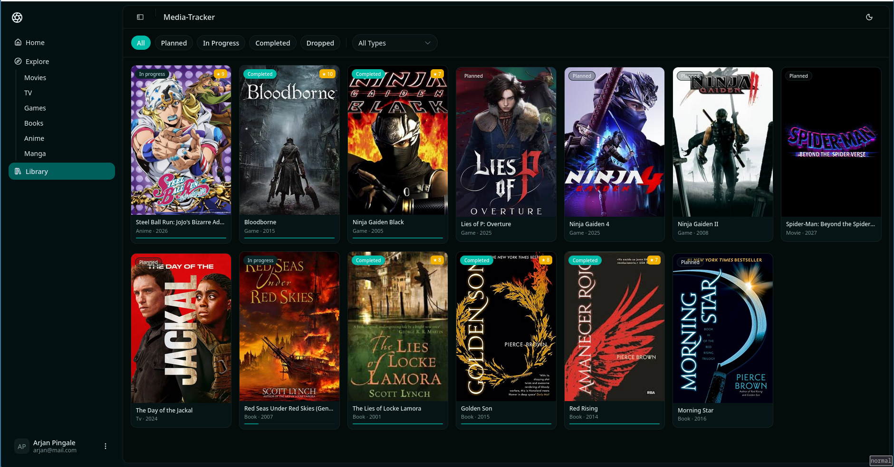
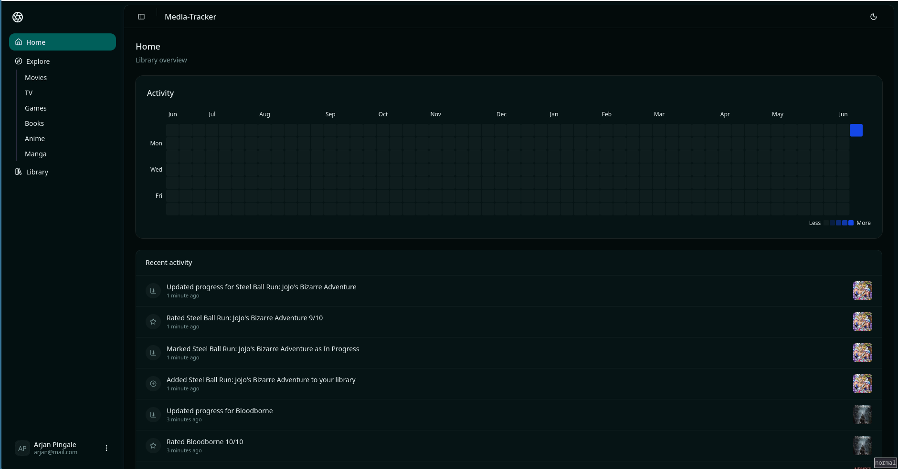
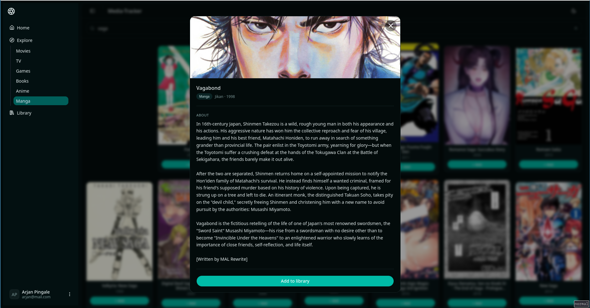

# Media Tracker

Add → Track → Complete → Rate → Review

## Monorepo structure

```
packages/
├── api         # Fastify backend API
├── shared      # Shared types/schemas
├── web         # React frontend
```

## Screenshots







## Getting started

### Prerequisites

- Nodejs
- pnpm
- Docker

## Installation

```
git clone https://github.com/Arjan-P/media-tracker.git && cd media-tracker

# Install appropriate tool versions
asdf install

# install dependencies
pnpm install
```

## Packages Overview

### packages/api

- REST api
- auth

### packages/shared

- shared dto's

### packages/web

- app UI

## Running Developement Environment

### Start Infra

```
# from monorepo root
docker compose -f infra/docker-compose.yml --env-file infra/.env.example up -d
```

### Build dependancies

```
# from monorepo root
pnpm run build
```

### Start processes

```
# from monorepo root
pnpm --filter @media-tracker/api start
pnpm --filter @media-tracker/web dev
```

### Production

Dockerfile in packages/api to build api image
